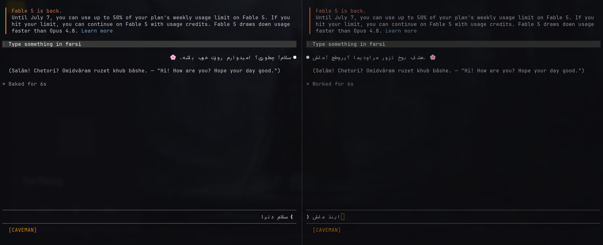

# rtlwrap

Correct right-to-left (Persian, Arabic, Hebrew) rendering for terminal programs
that do not support it, without any cooperation from the program itself.

rtlwrap is a small PTY wrapper. It sits between a command and your terminal,
reads the command's output, reshapes the right-to-left runs (bidi reordering
plus Arabic/Persian cursive joining into presentation forms), and forwards the
corrected text to the terminal. Your keystrokes pass through unchanged. The
wrapped program never knows it is there.

## Demo



Left: a program running under rtlwrap, with Persian in the correct
right-to-left order and joined. Right: the same program without rtlwrap, where
the terminal shows the text in logical order and unjoined.

## Why

Many terminal programs emit RTL text in logical order and assume the terminal
will reorder it. Terminals that do no bidi processing then display it backwards
and unjoined. rtlwrap does that reordering and shaping in transit, so those
programs read correctly in a plain terminal.

## Platform support

- Linux: supported.
- macOS: supported.
- Windows: not tested yet. It relies on a Unix PTY, so it is unlikely to work
  as-is on Windows.

## Install

### With Go

```sh
go install github.com/Har2yQn78/rtlwrap/cmd/rtlwrap@latest
```

This puts the `rtlwrap` binary in `$(go env GOPATH)/bin` (add it to your `PATH`).

### Linux package (.deb / .rpm)

Download the package for your distro from the
[Releases](https://github.com/Har2yQn78/rtlwrap/releases) page. It installs the
binary to `/usr/bin/rtlwrap`.

```sh
# Debian / Ubuntu
sudo dpkg -i rtlwrap_*_linux_amd64.deb
# Fedora / RHEL
sudo rpm -i rtlwrap_*_linux_amd64.rpm
```

### Prebuilt binary

Or download the `tar.gz` for your OS and architecture from the
[Releases](https://github.com/Har2yQn78/rtlwrap/releases) page, extract it, and
move the `rtlwrap` binary somewhere on your `PATH`.

### From source

```sh
git clone https://github.com/Har2yQn78/rtlwrap.git
cd rtlwrap
go build -o rtlwrap ./cmd/rtlwrap
```

## Usage

Put `rtlwrap` in front of any command you want RTL-corrected:

```sh
rtlwrap <program> [args...]
```

Examples:

```sh
rtlwrap claude
rtlwrap codex
rtlwrap antigravity
```

Or, if you built the binary locally and did not put it on your `PATH`:

```sh
./rtlwrap claude
./rtlwrap codex
./rtlwrap antigravity
```

Everything the program prints is reshaped; everything you type is sent through
untouched.

## How it works

rtlwrap runs the program on a pseudo-terminal and picks a renderer based on what
the program is doing:

- Scrolling / static output (for example `rtlwrap cat file.fa`,
  `rtlwrap git log`) is shaped line by line as it streams, preserving your
  terminal's scrollback.
- Full-screen interactive programs that use the alternate screen are reshaped
  against a virtual terminal grid, so cursor-positioned repaints reorder
  correctly.

ANSI escape sequences and control bytes are always passed through byte for byte;
only actual text runs are ever reshaped.

## Terminal compatibility

rtlwrap is for terminals that do no bidi of their own. Use it with terminals
like Ghostty, Warp, Kitty, foot, xterm, GNOME Terminal, Konsole, or VS Code's
terminal.

Do not use it with a terminal that already does its own bidi and Arabic shaping
(for example Zed's embedded terminal). There, run the program directly, without
rtlwrap. Wrapping a bidi-aware terminal reorders the text twice and scrambles
it. See [docs/limitations.md](docs/limitations.md) for the full list of known
limitations, including the monospace cell gap between joined letters.

## Limitations

rtlwrap has real, documented limits: the monospace cell gap between joined
letters, terminals that do their own bidi (do not wrap those), redraw behavior
in some programs, and Unicode edge cases. Please read
[docs/limitations.md](docs/limitations.md) before filing an issue, so you know
what is a bug and what is a known boundary.

## Contributing

If rtlwrap helped you, please leave a star. It is the simplest way to show the
project is useful and worth maintaining.

Contributions are very welcome. Bug reports, terminal compatibility notes,
better shaping coverage, and Windows support are all wanted. Open an issue to
discuss a change, or send a pull request. Please run `go vet ./...` and
`go test ./...` before submitting.

## License

MIT. See [LICENSE](LICENSE).
